# Exercise 1: HoloWord.

## Goals

* Get familiar with Unity3D.

    * GameObjects

    * Component

    * Prefab

    * Assets

* Import HoloToolKit.

* Generate OutPut Project.

* Deploy to HoloLens Device / Emulator.

## Task 1: Create a new project in Unity3D

1. Start Unity3D (you can download from [here](https://store.unity.com/es/download?ref=personal)).

1. Create a new 3D project. Name something like _HoloWorld_.

    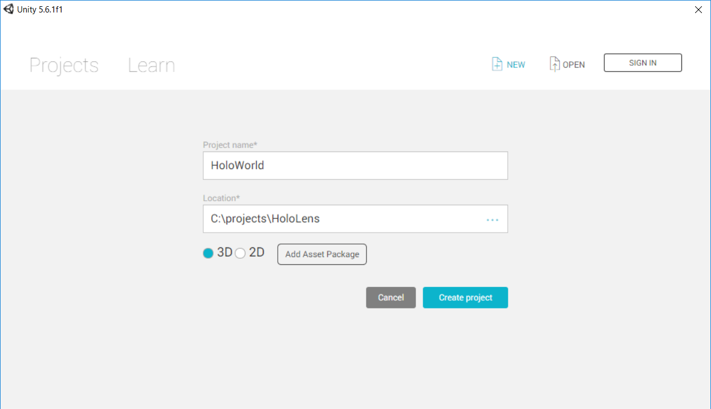

1. You will get a empty project layout as follow.

    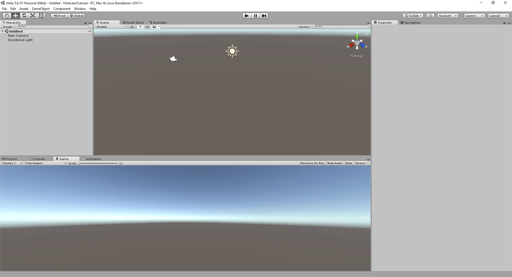

### Scene View
The Scene View is your interactive view into the world you are creating. You will use the Scene View to select and position scenery, characters, cameras, lights, and all other types of Game Object. Being able to Select, manipulate and modify objects in the Scene View are some of the first skills you must learn to begin working in Unity.

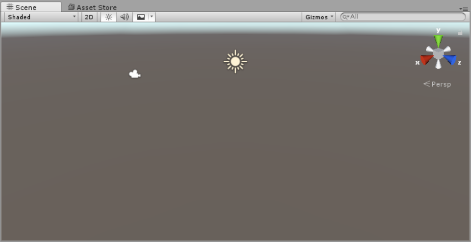

#### Moving, orbiting and zooming in the Scene View

Moving, orbiting and zooming are key operations in Scene View navigation. Unity provides several ways to perform them for maximum accessibility:

##### Arrow movement

You can use the Arrow Keys to move around the Scene as though “walking” through it. The up and down arrows move the Camera forward and backward in the direction it is facing. The left and right arrows pan the view sideways. Hold down the Shift key with an arrow to move faster.

##### Move, Rotate, Scale, and RectTransform

Use the four Transform tools in the toolbar to **Move**, **Rotate**, **Scale**, or **Rect Transform** individual GameObjects. Each has a corresponding Gizmo that appears around the selected GameObject in the Scene view. To alter the Transform component of the GameObject, use the mouse to manipulate any Gizmo axis, or type values directly into the number fields of the Transform component in the Inspector.

Alternatively, you can select each of the four **Transform** modes with a hotkey: **W** for Move, **E** for Rotate, **R** for Scale and **T** for RectTransform.

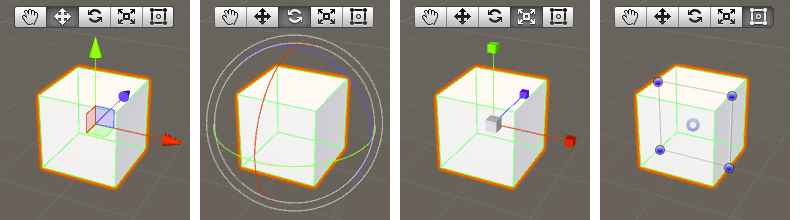

### Hierarchy View
The Hierarchy window contains a list of every GameObject (referred to in this guide as an “object”) in the current Scene. Some of these are direct instances of Asset files (like 3D models), and others are instances of Prefabs, which are custom objects that make up most of your game. As objects are added and removed in the Scene, they will appear and disappear from the Hierarchy as well.

By default, objects are listed in the Hierarchy window in the order they are made. You can re-order the objects by dragging them up or down, or by making them “child” or “parent” objects (see below).

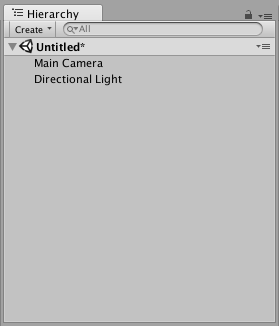

#### Parenting

Unity uses a concept called Parenting. When you create a group of objects, the topmost object or Scene is called the “parent object”, and all objects grouped underneath it are called “child objects” or “children”. You can also created nested parent-child objects (called “descendants” of the top-level parent object).

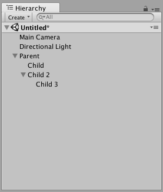

### Project View

In this view, you can access and manage the assets that belong to your project.

The left panel of the browser shows the folder structure of the project as a hierarchical list. When a folder is selected from the list by clicking, its contents will be shown in the panel to the right.

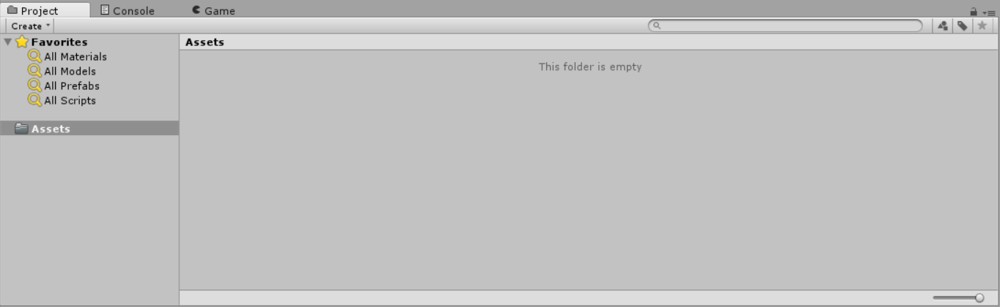

### Game View

The Game View is rendered from the Camera(s) in your game. It is representative of your final, published game. You will need to use one or more Cameras to control what the player actually sees when they are playing your game.

#### Play mode

Use the buttons in the Toolbar to control the Editor Play Mode and see how your published game plays. While in Play Mode, any changes you make are temporary, and will be reset when you exit Play Mode. The Editor UI darkens to remind you of this.

### Asset Store View

The Unity Asset Store is home to a growing library of free and commercial assets created both by Unity Technologies and also members of the community. A wide variety of assets is available, covering everything from textures, models and animations to whole project examples, tutorials and Editor extensions. The assets are accessed from a simple interface built into the Unity Editor and are downloaded and imported directly into your project.

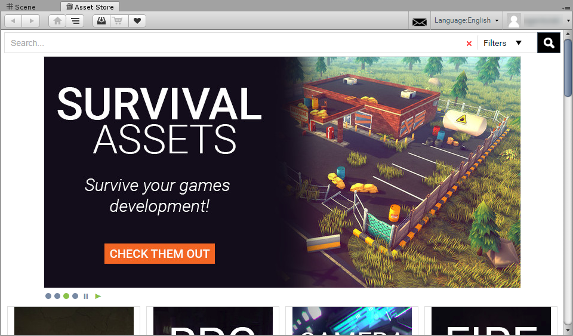

> **NOTE:** On your first visit, you will be prompted to create a free user account which you will use to access the Store subsequently.

The Store provides a browser-like interface which allows you to navigate either by free text search or by browsing packages and categories. To the left of the main tool bar are the familiar browsing buttons for navigating through the history of viewed item.

## Task 3: Import HoloToolKit Unity Asset

1. Download the [latest version](https://github.com/Microsoft/HoloToolkit-Unity/blob/master/External/Unitypackages/HoloToolkit-Unity-v1.5.7.0.unitypackage) of the HoloToolKit to a location to easy access. [Here](https://github.com/Microsoft/HoloToolkit-Unity/tree/master/External/Unitypackages) you can find all of then.

    The HoloToolkit is a collection of scripts and components intended to accelerate development of holographic applications targeting Windows Holographic.

    HoloToolkit contains the following feature areas:

    1. Input (Gaze, Cursors and Targeting)
    1. Sharing
    1. Spatial Mapping
    1. Spatial Understanding
    1. Spatial Sound
    1. Utilities
    1. Build

1. In Unity3D, go to **Assets** menu and then **Import Package** and finally **Custom Package**. In the opened _File open_ dialog, pick the HoloToolKit asset file you downloaded (usual named _HoloToolkit-Unity-v1.5.7.0.unitypackage_).

1. After a few moments, a window will prompt for the items to import to your project. At now, you can click **Import** with all the items selected.

    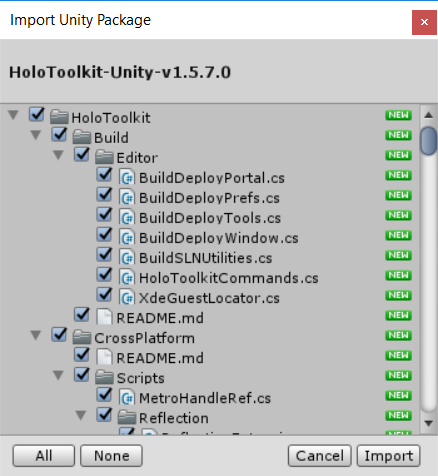

## Task 3: Configure your project to work with HoloLens

1. First, save your scene. Go to **File** menu, and **Save Scenes** (or its shortcut **Ctrl+S**). Name your scene file as you like, this not impact on your game. Scenes contain the objects of your game. Think of each unique Scene file as a unique level. In each Scene, you will place your environments, obstacles, and decorations, essentially designing and building your game in pieces.

1. When imported, HoloToolKit adds a new menu to shortcut some common task. Click on it and open the **Configure** menu.

    Inside this menu there is a sub-menu that will Configure some parts to enabled to work or work fine in side HoloLens. Click **Apply HoloLens Scene Settings** and a popup should be displayed. Ensure all checks are checked and click Apply. Save your scene. This simple option configure a few hidden and dark options and let your project to be HoloLens compatible that to make manual, it will take some minutes and headaches. If you want to know what involves each option, you can hover each one with mouse pointer and you should see a description in the middle-bottom section.

    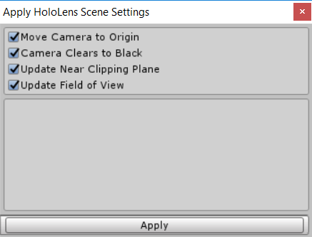

1. Do the same with the Apply HoloLens Project Settings. This popup will requires reload your entire project to force new settings take effect.

    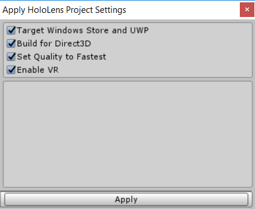

## Task 3: Add your first GameObject

1. Click on the **GameObject** menu, then **3D Object** and then choose **Cube** menu. A cube will be added to the scene at the default coordinates (x:0, y:0, z:0). With the cube selected in the _Hierarchy view_, look up to the _Inspector View_. There, you will find the components added to the GameObjects.

    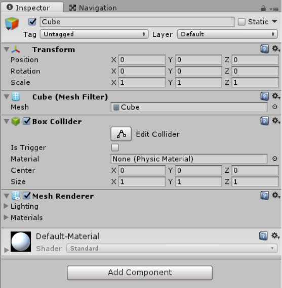

    Following are the most remarkable default Components for this GameObject:

    ### Transform Component
    The Transform component determines the Position, Rotation, and Scale of each object in the scene. Every GameObject has a Transform. The position, rotation and scale values of a Transform are measured relative to the Transform’s parent. If the Transform has no parent, the properties are measured in world space.

    | Property | Function |
    |--|--|
    | Position| Position of the Transform in X, Y, and Z coordinates. |
    |Rotation | Rotation of the Transform around the X, Y, and Z axes, measured in degrees. |
    |Scale | Scale of the Transform along X, Y, and Z axes. Value “1” is the original size (size at which the object was imported). |

    ### Box Collider Component
    The Box Collider is a basic cube-shaped collision primitive. These are obviously useful for anything roughly box-shaped, such as a crate or a chest. However, you can use a thin box as a floor, wall or ramp. The box shape is also a useful element in a compound collider.

    If the **Is Trigger** option is checked, this Collider is used for triggering events, and is ignored by the physics engine.

2. Update the **Z position** of the Cube to 5.

    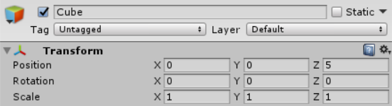

3. Press the **Play button** () in the top-middle to preview your scene in the _Game View_. You should see the cube in a black environment. Note that you can do anything more there.

    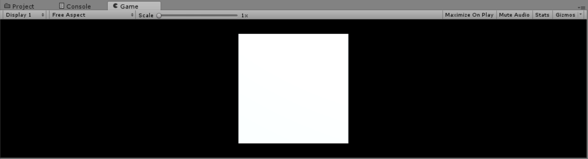

1. Press the **Play button** () again to stop the execution.

    > NOTE: While your running the scene in Unity3D, the **Play**, **Pause** and **Step** buttons will turn to blue.

## Task 4: Build you project

1. Click in the **File** menu, then in the **Build Settings** sub-menu. In the opened window, you can note that the **Windows Store** platform is already selected. This is made by the **Apply HoloLens Project Settings** made a few steps before.

1. Click in the **Add Open Scene** button to add to the final project the actives scenes. If there are more scenes in your project you can add/remove which ones you desire via a check aside the name of the scene.

1. Check the Copy Reference and Unity C# Project options.

    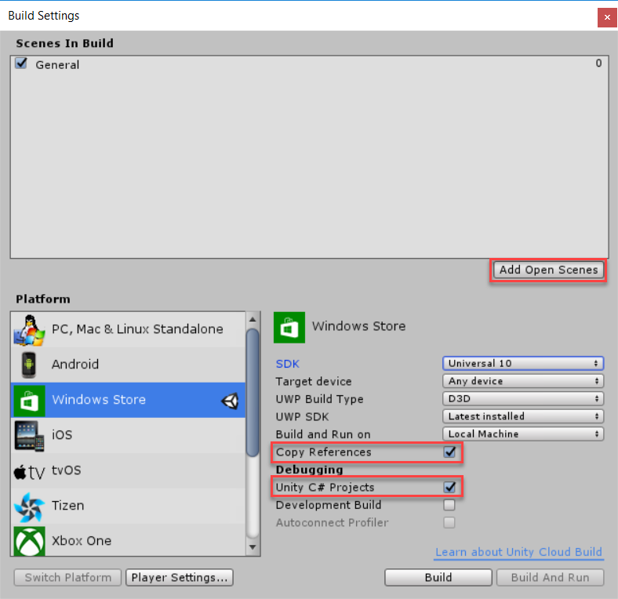

1. Finally, check the Build button. A window should appears prompting to select the folder to put the output for your project. Create a new folder with a name you like (for example: _Output_ or _App_). After a few moment, an Explorer window will open with the result of of your project.

## Task 5: Deploy your App

1. Navigate to the output folder you choose in the previous step. Inside, you should find a _\<YourProject\>.sln_ file. Open it with _Visual Studio 2015_ or _2017_. Once the project has opened in Visual Studio. Let's make some last tweaks.

1. Change the **Solution Platform** from ARM to **x86**.

1. Expand the **Target Device** from Local Machine to **Hololens emulator \<Version\>** or **Remote** Machine if you have a Hololens device with you (you need to provide the IP and the PIN).

    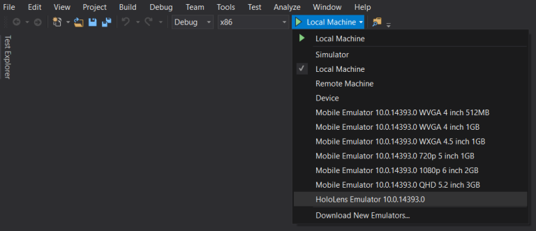

1. Build and run to test it. If your choose to open in the Hololens emulator, you will see how the OS will start over and then your app will deploy and executed. You can simulate you move around the cube with the **wasd** keys to walk, or the arrows key to rotate your point of view. Additionally, you can move and click your mouse.

    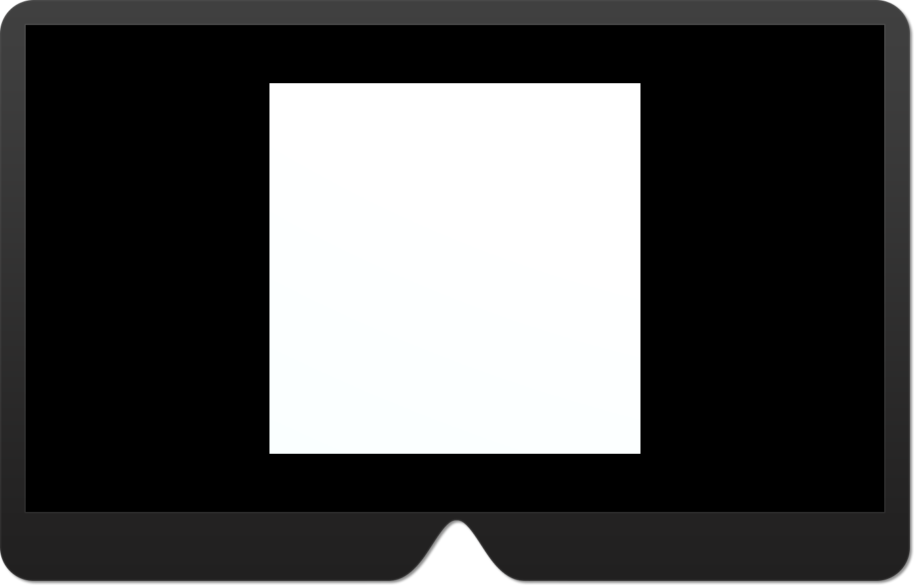

## Task 6: Improve the Sample with Assets

1. Now that you have learned the boring basis, lets make some pretty tweaks for your project. Go back to your project in Unity3D.

1. In the _Hierarchy view_, select and delete the Cube.

1. Go to the **Asset Store** view. You will be that the store is a extremely rough and contains lots of things you can just import to your project. To replace the plain white cube, choose some of the free asset in the store (for example, search `Free Animated Space Man` ).

1. When you've found something you like, click in the **Download** button. And when finish download, click in the **Import** button. A similar window that appears when imported the HoloToolKit asset will be shown, with the content of the asset you want to download. Click in the import button.

1. You may see that a folder is created in the Project view, which contains the package imported. Explore that folder until you found a .prefab file (it usually will be inside a prefab folder).

1. Drag the file to the _Hierarchy view_ to put it on your scene.

1. In the _Hierarchy panel_, **delete** the default _Main Camera_ and _Directional Light_.

1. In the _Project view_, locate the `HoloToolKit\Input\Prefabs\HoloLensCamera.prefab` and drag it to the _Hierarchy view_. This is a specialized camera to work in Hololens and allow to emulate some behaviors in the _Game View_ inside Unity3D with no need to Build and Deploy to your device or the emulator. If you select the `HoloLensCamera` GameObject, you should see a **Camera Preview** window which display the default view when the scene starts.

    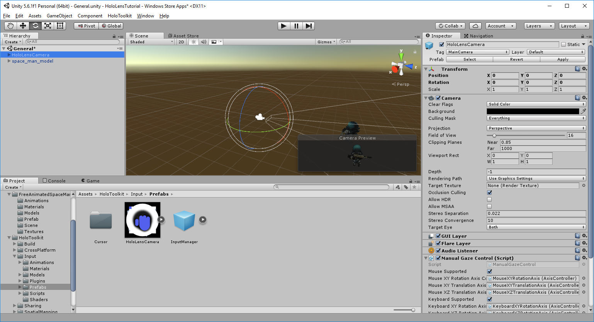

1. Play the scene () and notice because you replace the camera, now you can _walk_ and _rotate_ around the hologram.

1. When you think you have enough walking around, stop the scene ().

    > NOTE: You can try to put some other instance of the same asset or add others into the scene to add complexity to your scene.

1. Build your project again. Now you've configured your project, you can use the **HoloToolKit's Build** window (HoloToolKit menu -> Build). This will open a new tab that you can attach to any other existing tab or you can keep it floating. Update the Build Directory to the subfolder where you put the output project and click the Build Visual Studio SLN. With this, the Explorer window will not open. But a message will appears when the process has finished.

    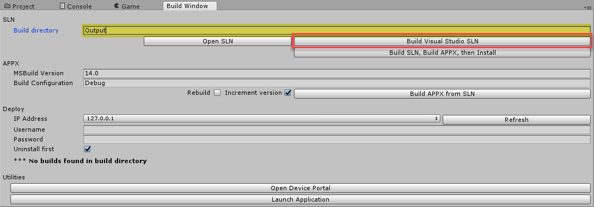

1. In Visual Studio, rebuild your project and deploy to the emulator or device. Now, you can walk around your hologram.

    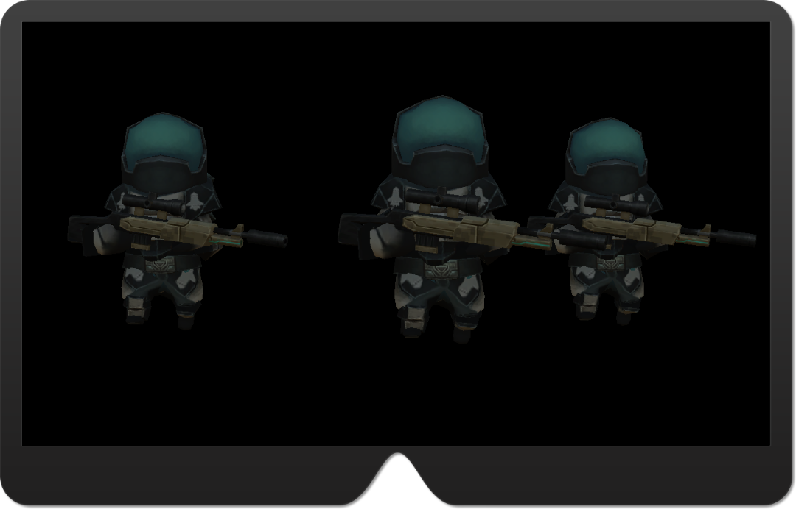