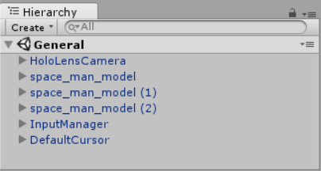
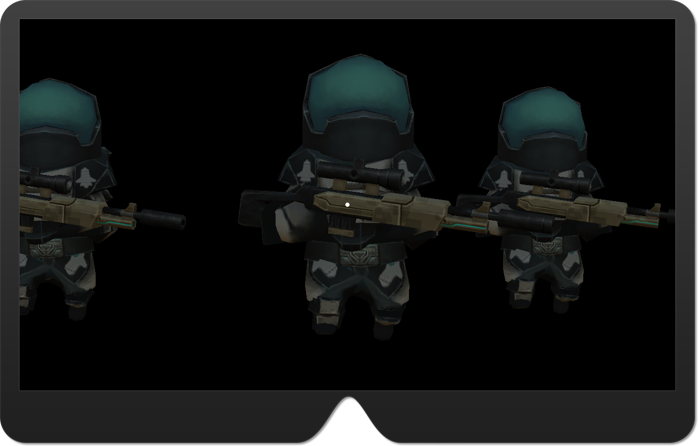
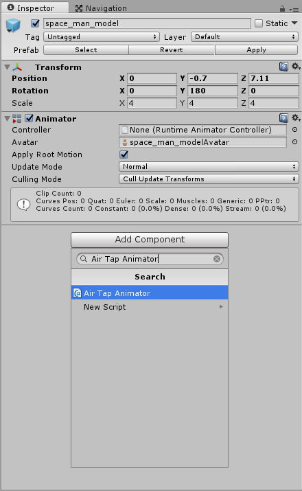
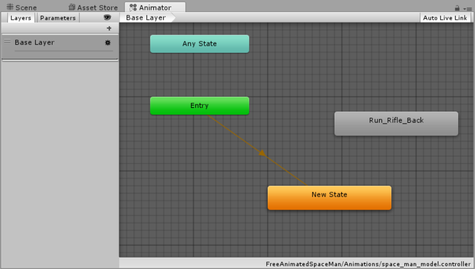
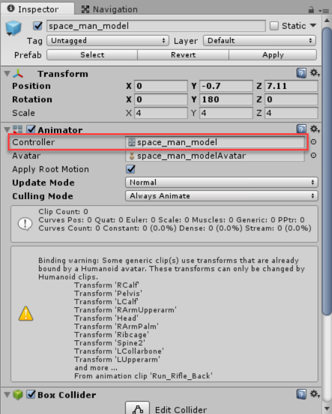
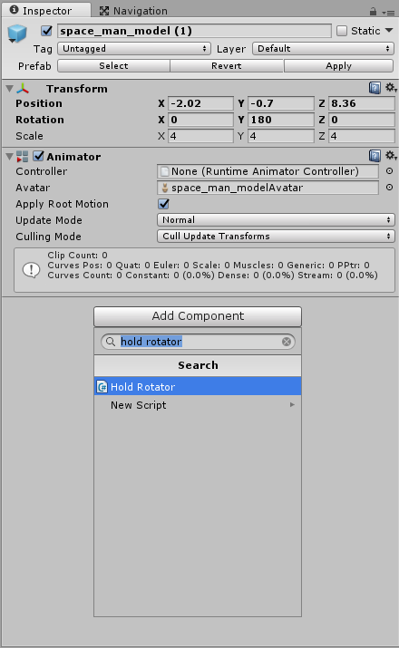
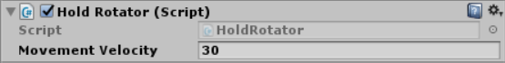
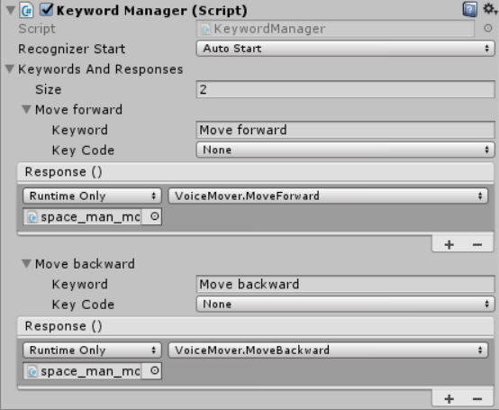
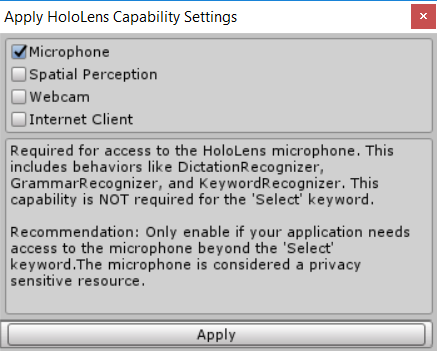
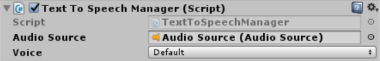

# Exercise 2: Inputs

## Goals

* Place a Gaze.
* Handle User Air Tap.
* Handle User Air Tap & Hold.
* Handle Voice Action Input.
* Play Text to Speech.
* Learn about UI elements
    * HeadIndicator
    * TagAlong
    * Billboard

> NOTE: We will assume that you already have an Unity working project similar as described in Exercise 1.

## Task 1: Place a Gaze

1. In the _Project View_, navigate to the **HoloToolkit\Input\Prefabs** folder. Drag the InputManager.prefab file to the _Hierarchy view_. This component is the one responsible for manage the User Input (Gaze and Gestures).

1. In the _Project View_, navigate to the **HoloToolkit\Input\Prefabs\Cursor** folder. Drag the **DefaultCursor.prefab** file to the _Hierarchy view_.

    Your project should look like this:

    

1. You may try test your project into Unity3D or _Build_ your project and see that a Default Gaze is now in your application. Note that if you move your vision, the gaze will follows it indicating what you are selecting.

    


## Task 2: Handle User Air Tap

In this task, you will handle the Air Tap gesture and play an animation of your asset.

> NOTE: Not all the assets comes with Animation. So, you must check it out and know the animation name.

1. In the _Project View_, go to the root folder and create a new folder (right click on an empty space of the right panel, and then choose Create->Folder). Name the folder _Scripts_.

1. Enter to new folder and create a new C# Script (right click on an empty space of the right panel, and then choose Create->C# Script) named _AirTapAnimator_. Next, open the file in Visual Studio, doing double click on it.

    You will notice that the empty class has to default method:

    1. `Start`: this method is the first executed for the object and is used to initialize object's variables.

    1. `Update`: this method is used to refresh your GameObject. But, be careful because this method execute many times by second.

1. Implement the interface `IInputClickHandler` (namespace: `HoloToolkit.Unity.InputModule`) and the `OnInputClicked` method for this interface. This method will be called each time the user make a _Air Tap_ on a GameObject

    ``` csharp
    public void OnInputClicked(InputClickedEventData eventData)
    {
        throw new NotImplementedException();
    }
    ```

1. Update the class to define a private variable to store the **Animator** component. In the `Start` method, write code to access to the GameObject the script is attached and get the component `Animator`. Finally, in the `OnInputClicked` method, insert code to play the GameObject animation (_"RunRifleForward"_). Your code should look similar to the following:

    ``` csharp
    using HoloToolkit.Unity.InputModule;
    using UnityEngine;

    public class AirTapAnimator : MonoBehaviour, IInputClickHandler
    {
        private Animator animator;

        // Use this for initialization
        void Start()
        {
            this.animator = this.GetComponent<Animator>();
        }

        // Update is called once per frame
        void Update()
        {
        }

        public void OnInputClicked(InputClickedEventData eventData)
        {
            this.animator.Play("Run_Rifle_Forward");
        }
    }
    ```

    Make sure to save the file before go further.

1. Back to Unity and select you GameObject. Click on the **Add Component** button in the _Inspector View_. Type **Air Tap Animator** and press enter. This is one way to add our component to our GameObject. Other way, is to drag the file to the GameObject in the _Hierarchy view_, or to the _Inspector View_ with the GameObject desired selected.

    


1. Next, click again in the **Add Component** button, now search for the **Box Collider** component. You may want reduce the area that receives the event, so you can click on the **Edit Collider** button in the **Box Collider** component. This will display some point that you can modify with the mouse; otherwise you can change with the numbers for **Center** and **Size** properties.

    ### Box Collider Component
    The Box Collider is a basic cube-shaped collision primitive. These are obviously useful for anything roughly box-shaped, such as a crate or a chest. However, you can use a thin box as a floor, wall or ramp. The box shape is also a useful element in a compound collider.

    > NOTE: If you're using the Free Animated Space Man Preset, you will need to do this tweaks to get the best experience.

    > 1. Locate **FreeAnimatedSpaceMan\Animations\space\_man\_model.controller** and double click on it. The Animator view will open. This window represent the machine state of animations.
    > 1. Right click on an empty space of the grey grid and click on **Create State**, then **Empty**. Select the created state and right click on it. Then click **Set as Layer Default State**.
    > 
    > 1. Finally, go back to the **Scene view** and the **space\_man\_model**. On the Animator component (in the **Inspector view**) drag the **space\_man\_model.controller** into the Controller property.
    > 

1. Test your scene in Unity3D. To simulate the Air Tap, you can hold the Left Shift Key (for left hand) or the Space Bar (for right hand) and click with your mouse. If you click in the area where the collider extend, the animation will play.

## Task 3: Handle User Air Tap & Hold

1. In Unity3D, let's create a new script named `HoldRotator` in the Script folder. This script will handle the _Air Tap & Hold_ Gesture and rotate the Hologram while the user hold the Gesture. Open the file in Visual Studio.

1. To handle this Gesture, you need to implement the `IHoldHandler` interface (namespace: `HoloToolkit.Unity.InputModule`). Implement the three method required. The first is method is the `OnHoldStarted` which indicate the gesture is recognized. The second is the `OnHoldCompleted` which indicate the user release the hold. The third method is the `OnHoldCanceled` which indicates the user cancel the Gesture. This can be achieve if the user move the gaze outside the Collider of the object.

1. Define a flag at class level, to allow determine if the user is holding the Gesture. Set to `false` when the user complete or cancel the Gesture (`OnHoldCompleted` and `OnHoldCanceled` method) and set to true in `OnHoldStarted`.

1. Define a parameter for your component to allow to set the velocity of the movement from Unity Editor. You can set a default value (30 for example).

    > NOTE: All the public variables will be exposed as property to the Unity3D editor.

1. In the `Update` method, check for the flag value and if `true` apply a rotation taking in count your parameter.

    Your code may look similar to the following one:

    ``` csharp
    using HoloToolkit.Unity.InputModule;
    using UnityEngine;

    public class HoldRotator : MonoBehaviour, IHoldHandler
    {
        public float MovementVelocity = 30f;

        private bool isHolding = false;

        public void OnHoldCanceled(HoldEventData eventData)
        {
            isHolding = false;
        }

        public void OnHoldCompleted(HoldEventData eventData)
        {
            isHolding = false;
        }

        public void OnHoldStarted(HoldEventData eventData)
        {
            isHolding = true;
        }

        // Use this for initialization
        void Start()
        {
        }

        // Update is called once per frame
        void Update()
        {
            if (this.isHolding)
            {
                this.transform.Rotate(Vector3.up * Time.deltaTime * this.MovementVelocity, Space.World);
            }
        }
    }
    ```

    > NOTE: The first operand for the `Rotate` is the direction to where rotate. In this example, the hologram will rotate to the right. The `Time.deltaTime` is the time in seconds it took to complete the last frame (Read Only). You can use this function to make your game frame rate independent and movement more smooth.

1. Back to Unity and select you GameObject. Click on the **Add Component** button in the _Inspector View_. Type **Hold Rotator** and press enter.

    

1. You should see the property **Movement Velocity** in the Hold Rotator component preset to 30. Now, you can change it without need to open your code.

    

1. You can run your project into Unity3D and simulate the Gesture in the GameObject you've attached the new component and see how it rotate to the right.

## Task 4: Handle Voice Input

1. Create a new script named **VoiceMover** into the Script folder. Create two methods: `MoveForward` and `MoveBackward`.

1. Add the new component to the GameObject which will be moved by the Voice Command. If you are following this sample, it should be a space\_man\_model GameObject.

    Your code should look as follows:

    ``` csharp
    using UnityEngine;

    public class VoiceMover : MonoBehaviour
    {
        public float MovementVelocity = 30f;

        public void MoveForward()
        {
            this.transform.Translate(Vector3.forward * Time.deltaTime * this.MovementVelocity);
        }

        public void MoveBackward()
        {
            this.transform.Translate(Vector3.back * Time.deltaTime * this.MovementVelocity);
        }
    }
    ```

1. In the _Hierarchy View_ in Unity3D, create a empty GameObject and rename it to **SpeechManager**. This GameObject will handle the user command to move forward the given GameObject.

1. In the **SpeechManager**, add the **Keyword Manager**. Expand the **Keywords And Response** section. Enter **2** in the _Size_ property because you will respond to the `Move forward` and `Move backward` phases.

1. Expand the first element (0). Enter the command `Move forward` into the Keyword property.

1. In the **Response** section, click on the plus icon (). Drag the GameObject that has attached the **SpeechManager** component (for example the space\_man\_model GameObject).

1. Open the combo that says "No Function" and note that it list all the components attached to the GameObject. Select the **VoiceMover** component and next the `MoveForward` function.

1. Repeat the same step for the Element 1, but with the `Move Backward` command.

    

1. To try it out, you will need to build your process and test into the _Hololens Emulator_ or your device.

> NOTE: Make sure to add the Microphone capabilities in your app in Unity3D, go to the **HoloToolKit** menu and next Configure and **Apply HoloLens Capabilities Settings**. Once there, check the Microphone option.
>
> 

## Task 5: Play Text to Speech

Now, you will learn how to provide spoken feedback to the user.

1. In the Hierarchy View, select the **GameObject** and then the Audio sub-menu and next the **Audio Source** option.

1. In the GameObject that you've attached the `VoiceMover`, attach the `Text To Speech Manager`. In the new component, drag the **Audio Source** just created into the **Audio Souce** property.

    

1. Update the VoiceMover class to get the instance of the **TextToSpeechManager** on the `Start` method and inform the user the GameObject is moving forward and backward on each method using the `SpeakText` method of the **TextToSpeechManager** instance.

    For code should be similar as follows:

    ``` csharp
    using HoloToolkit.Unity;
    using UnityEngine;

    public class VoiceMover : MonoBehaviour
    {
        public float MovementVelocity = 30f;

        private TextToSpeechManager textToSpeechManager;

        public void MoveForward()
        {
            this.transform.Translate(Vector3.forward * Time.deltaTime * this.MovementVelocity);
            this.textToSpeechManager.SpeakText("Moving forward, sir!");
        }

        public void MoveBackward()
        {
            this.transform.Translate(Vector3.back * Time.deltaTime * this.MovementVelocity);
            this.textToSpeechManager.SpeakText("Moving backward, sir!");
        }

        // Use this for initialization
        void Start()
        {
            this.textToSpeechManager = this.GetComponent<TextToSpeechManager>();
        }

        // Update is called once per frame
        void Update()
        {
        }
    }
    ```

    > NOTE: The TextToSpeechManager has a method to play [SSML](https://www.w3.org/TR/speech-synthesis/) markup string.

1. To test this latest changes, you need to build your solution and test either on your **Hololens Device** nor the **Hololens Emulator**.