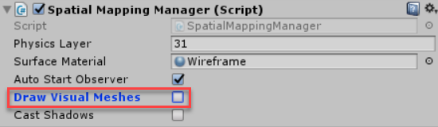
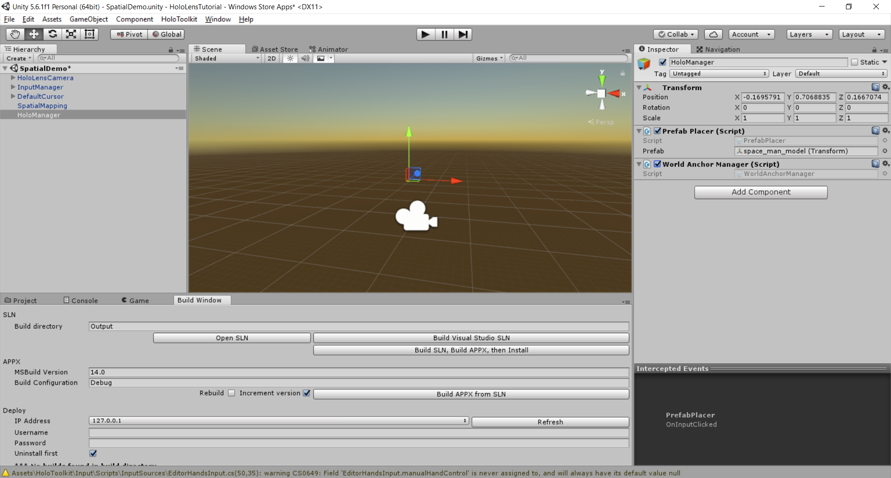
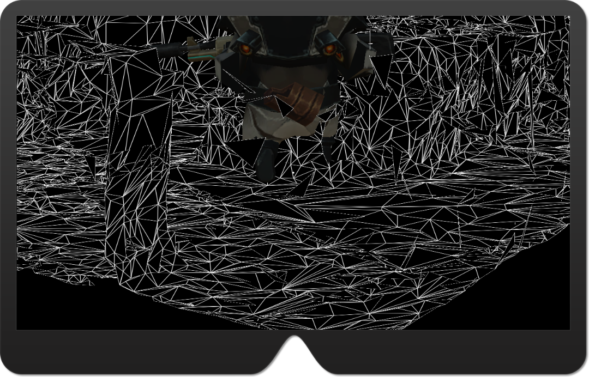
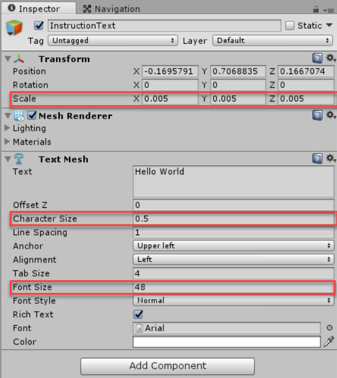
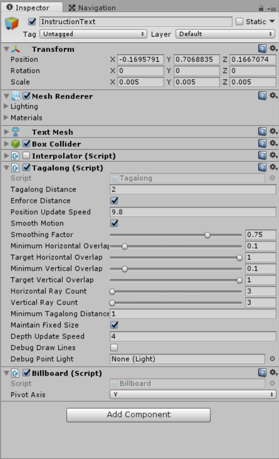

# Exercise 3: Spatials

## Goals

* Map user room.
* Query place where to place hologram into real world.
* Add spatial sound to holograms.
* Learn about UI elements
    * HeadIndicator
    * TagAlong
    * Billboard

## Task 1: Add Spatial Mapping

1. Create a new scene. Click in the **File** menu and click in **New Scene**. **Delete** the _Main Camera_ and _Directional Ligth_. Save it with a name like _SpatialDemo.unity_.

1. Go to the **HoloToolKit** menu, and then **Configure** and then click **Apply HoloLens Scene Settings** and a popup should be displayed. Apply with all the options checked.

1. Drag the `HololensCamera` and the `InputManager` prefabs from the _HoloToolKit\Input\Prefabs_ folder to the **Hierarchy view**. Also add a Gaze to the scene (e.g. t     he **DefaultCursor** located in _HoloToolKit\Input\Prefabs\Cursor_ folder).

1. Locate the _HoloToolKit\SpatialMapping\Prefabs_ folder and then drag the `SpatialMapping`. This prefab is the responsible to scan your environment and generate a mesh which your GameObject can interact. With this, you can put a hologram on a surface you've scanned.

1. Select the `SpatialMapping` into your scene and uncheck the **Draw Visual Meshes** option in the **Spatial Mapping Manager** component.

    

1. In the _Hierarchy View_ in Unity3D, create a empty GameObject and rename it to **HoloManager**. This GameObject will instantiate a parametrized prefab into the scene and will enable the user to move it along the spatial mapping's mesh.

1. Create a new C# script named `PrefabPlacer` in the _Script_ folder and open it with Visual Studio.  Define a public variable to allow the configure the prefab to instantiate from the Unity editor.

1. Implement the `IInputClickHandler` and its `OnInputClicked` method. In the method, you need to call `Instantiate` passing as its parameter the **prefab** variable. This function return the instance created so you can attach the `TapToPlace` component, which will handle when the user click on it and will move the hologram following the gaze and responding to the spatial mapping scanned.

1. In this case you will need to force the click to be handled either the gaze isn't selecting a hologram. You need to push back the input gestures, doing the following in the `Start` method.

    Your class should like follows:

    ``` csharp
    using System;
    using HoloToolkit.Unity.InputModule;
    using HoloToolkit.Unity.SpatialMapping;
    using UnityEngine;

    public class PrefabPlacer : MonoBehaviour, IInputClickHandler
    {
        public Transform prefab;

        public void OnInputClicked(InputClickedEventData eventData)
        {
            var prefabInstance = Instantiate(prefab);
            prefabInstance.gameObject.transform.position = GazeManager.Instance.GazeOrigin + GazeManager.Instance.GazeNormal * 1.5f; ;
            prefabInstance.gameObject.AddComponent<TapToPlace>();
        }

        // Use this for initialization
        void Start()
        {
            InputManager.Instance.PushFallbackInputHandler(this.gameObject);
        }

        // Update is called once per frame
        void Update()
        {
        }
    }
    ```

1. Save your work in Visual Studio and go back to Unity Editor. There, select the **HoloManager** GameObject and attach your `PrefabPlacer` script. Then, drag the prefab of your choice to the _Prefab_ property.

    > NOTE: You will need that the chosen prefab has a **Collider** component attached to it. You can select the prefab file in the _Project view_ and add Collider component as usual. Take in count that all you put to the prefab will be inherited when you instantiate it later.

    Your project should look like bellow:

    

1. Add the **World Anchor Manager** to the **HoloManager**. This component is responsible to track the object in the world and remember it positions.

1. To fully test your scene you need to deploy to the Hololens device or Emulator. In Unity you only can test the placement of the Holograms, but not the TapToPlace component. As you add a new scene in your project, you need to add it to the **Build Settings**. Click on the **Add Open Scene** and next uncheck the General scene to only keep active the new one.

1. Build your project as usual and open it on Visual Studio and deploy it to try. You should notice that when you make a AirTap selecting an hologram it will activate the `TapToPlace` component and it will display the **Spatial Mapping mesh**.

1. Go to the **HoloToolKit** menu, and then **Configure** and then click **Apply HoloLens Capabilities Settings**. Check the **Spatial Perception** option and then click on _Apply_.

    

## Task 2: Add Spatial Understanding

1. Create a new scene. Click in the **File** menu and click in **New Scene**. **Delete** the _Main Camera_ and _Directional Ligth_. Save it with a name like _SpatialUnderstandingDemo.unity_.

1. Drag the `HololensCamera` and the `InputManager` prefabs from the _HoloToolKit\Input\Prefabs_ folder to the **Hierarchy view**. Also add a Gaze to the scene (e.g. the **DefaultCursor** located in _HoloToolKit\Input\Prefabs\Cursor_ folder).

1. Locate the _HoloToolKit\SpatialMapping\Prefabs_ folder and then drag the `SpatialMapping` prefab. This prefab is the responsible to scan your environment and generate a mesh which your GameObject can interact. With this, you can put a hologram on a surface you've scanned.

1. Select the `SpatialMapping` into your scene and uncheck the **Draw Visual Meshes** option in the **Spatial Mapping Manager** component. Because the SpatialUnderStanding will draw meshes

    

1. Locate the _HoloToolKit\SpatialUnderstanding\Prefabs_ folder and then drag the `SpatialUnderstanding` prefab. This component will give you a more sophisticated mesh and a finer scanning than the SpatialMapping. And you can query for space in the walls, floor and surfaces scanned.

1. Create an empty GameObject named `MappingOrchestator`. In this, you will attach the script that will scan and query for space in your room.

1. Create a new C# script named `ScanManager` in the Script folder. This script will start the spatial scan and will also determine when the user decides to complete the scan. When this is achieved, this script will place a hologram where it detects there is enough space. Attach this script to the `MappingOrchestator` GameObject.

### Improve the UI for the user

1. Add a new 3D Text to your scene. To do this, go to the **GameObject** menu, then **3D Object** and next **3D Text**. Rename the object to something like `InstructionText`. This GameObject allows to show text to the user in a 3D world.

1. Change the _Scale_ in the **Transform** component to **0.005** in the three dimensions. Then change in the _Text Mesh_ component the **Character Size** to **0.5** and the **Font Size** to **48**.

    

1. Because the text will be fixed on the space world, it could be great if this is always visible to the user. To make it possible, you simple need to add two components to the 3D Text.
    * The first is the **TagAlong** which make your object follows the view of the user. So, if the user turn left the GameObject which has attached this component, also will be turned to the left smoothly.
    * The second component is the **Billboard** which makes the GameObject to always look to the user. For this example, change the **Pivot Axis** the only follows the **Y** axis.

    

### Create the scanning logic

1. Open the `ScanManager` in Visual Studio. Add a public variable to pass from Editor the Text Mesh's 3D Text where to show the instructions to the user.

1. In the Start method, Request the Beginning of the scan. Subscribe to the event Spatial Understanding raise when the Scan State changes to handle when the scan is done to place the holograms.

1. In the Update method, check the scan state. If the user hasn't decided to finish scanning, display some metrics about the scanned surfaces to show some progress to the user.

1. Additionally, implement the `IInputClickHandler` interface and it method to handle the Air Tap Gesture. In the `OnInputClicked` method request the scan to be finished. It could take some time, because this take all the scanned surfaces and put all together. Whereas you didn't scan, it will join the nearest surface to get a closed room.

1. When the scan is done and finished, the script will query for the scan result to get the first surface in the floor to put a hologram. If is not enough surface, you may notify the user to re-try the scan. You may also validate if the scanned space reached the minimum your application need until you request the scan finish.

``` csharp
using System;
using HoloToolkit.Unity;
using HoloToolkit.Unity.InputModule;
using UnityEngine;

public class ScanManager : MonoBehaviour, IInputClickHandler
{
    public TextMesh InstructionTextMesh;
    public Transform FloorPrefab;

    // Use this for initialization
    void Start()
    {
        InputManager.Instance.PushFallbackInputHandler(this.gameObject);
        SpatialUnderstanding.Instance.RequestBeginScanning();
        SpatialUnderstanding.Instance.ScanStateChanged += ScanStateChanged;
    }

    private void ScanStateChanged()
    {
        if (SpatialUnderstanding.Instance.ScanState == SpatialUnderstanding.ScanStates.Scanning)
        {
            LogSurfaceState();
        }
        else if (SpatialUnderstanding.Instance.ScanState == SpatialUnderstanding.ScanStates.Done)
        {
            InstanciateObjectOnFloor();
        }
    }

    private void OnDestroy()
    {
        SpatialUnderstanding.Instance.ScanStateChanged -= ScanStateChanged;
    }

    // Update is called once per frame
    void Update()
    {
        switch (SpatialUnderstanding.Instance.ScanState)
        {
            case SpatialUnderstanding.ScanStates.None:
                break;
            case SpatialUnderstanding.ScanStates.ReadyToScan:
                break;
            case SpatialUnderstanding.ScanStates.Scanning:
                this.LogSurfaceState();
                break;
            case SpatialUnderstanding.ScanStates.Finishing:
                this.InstructionTextMesh.text = "State: Finishing Scan";
                break;
            case SpatialUnderstanding.ScanStates.Done:
                this.InstructionTextMesh.text = "State: Scan Finished";
                break;
            default:
                break;
        }
    }

    private void LogSurfaceState()
    {
        IntPtr statsPtr = SpatialUnderstanding.Instance.UnderstandingDLL.GetStaticPlayspaceStatsPtr();
        if (SpatialUnderstandingDll.Imports.QueryPlayspaceStats(statsPtr) != 0)
        {
            var stats = SpatialUnderstanding.Instance.UnderstandingDLL.GetStaticPlayspaceStats();
            this.InstructionTextMesh.text = string.Format("TotalSurfaceArea: {0:0.##} - WallSurfaceArea: {1:0.##} - HorizSurfaceArea: {2:0.##}", stats.TotalSurfaceArea, stats.WallSurfaceArea, stats.HorizSurfaceArea);
        }
    }

    public void OnInputClicked(InputClickedEventData eventData)
    {
        this.InstructionTextMesh.text = "Requested Finish Scan";

        SpatialUnderstanding.Instance.RequestFinishScan();
    }

    private void InstanciateObjectOnFloor()
    {
        const int QueryResultMaxCount = 512;

        SpatialUnderstandingDllTopology.TopologyResult[] _resultsTopology = new SpatialUnderstandingDllTopology.TopologyResult[QueryResultMaxCount];

        var minLengthFloorSpace = 0.2f;
        var minWidthFloorSpace = 0.2f;

        var resultsTopologyPtr = SpatialUnderstanding.Instance.UnderstandingDLL.PinObject(_resultsTopology);
        var locationCount = SpatialUnderstandingDllTopology.QueryTopology_FindPositionsOnFloor(minLengthFloorSpace, minWidthFloorSpace, _resultsTopology.Length, resultsTopologyPtr);

        if (locationCount > 0)
        {
            var FloorHologram = Instantiate(FloorPrefab, _resultsTopology[0].position, Quaternion.LookRotation(_resultsTopology[0].normal, Vector3.up));

            this.InstructionTextMesh.text = "Placed the hologram";
        }
        else
        {
            this.InstructionTextMesh.text = "I can't found the enough space to place the hologram.";
        }
    }
}
```

### Test your code

1. Turn back to Unity Editor and select the `MappingOrchestator` GameObject. Note that the ScanManager component it has attached, now accepts two parameters. In the `Instruction Text Mesh` drag the **InstructionText** 3D text. For the Floor Prefab, you can use the same prefab as previous exercises and task or add a new more accord to put in the floor (e.g. [this chair](https://www.assetstore.unity3d.com/en/#!/content/23556)).

1. Save your scene. As you add a new scene in your project, you need to add it to the **Build Settings**. Click on the **Add Open Scene** and uncheck others scenes to only keep active the new one.


TBD:
* HeadIndicator

## Task 3: Add Spatial Sound