# Exercise 4: Third Party Services

## Goals

* Image recognition with Vuforia.
* Object recognition with Vuforia.
* Face recognition with Cognitive Services’ FaceAPI.
* Query user context with Cognitive Services’ Computer Vision.
* Object recognition with Cognitive Services’ Custom Vision.

## Task 1: Image Recognition and Track

### Setup Vuforia Environment

1. Navigate to the [Vuforia Developer Portal](https://developer.vuforia.com), Log in or Register (if this is your first time). And click on the **Develop** top section and next click on the **License Manager** and then click on the **Add License** Key button. Licenses will determine your final target for your project. By now, you may choose the **Development** option. Complete with an **Application Name** like VuforiaImageSample.

    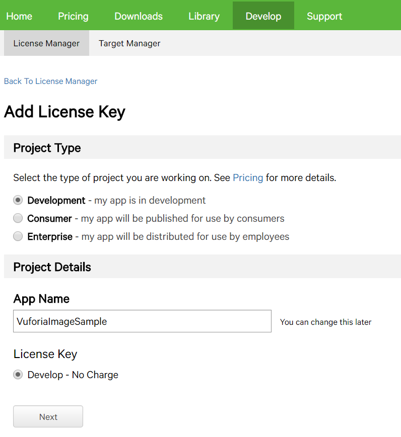

1. Click on the name of the recent created Licens and save the **License Key** for later usage.

1. Click on the **Target Manager** on the top sub-menu. And then click on the **Create Database** button. Choose a Database name (like _VuforiaImageDataBase_) and select **Device** as _Database Type_. Accept to dialog clicking on the **Create** button.

    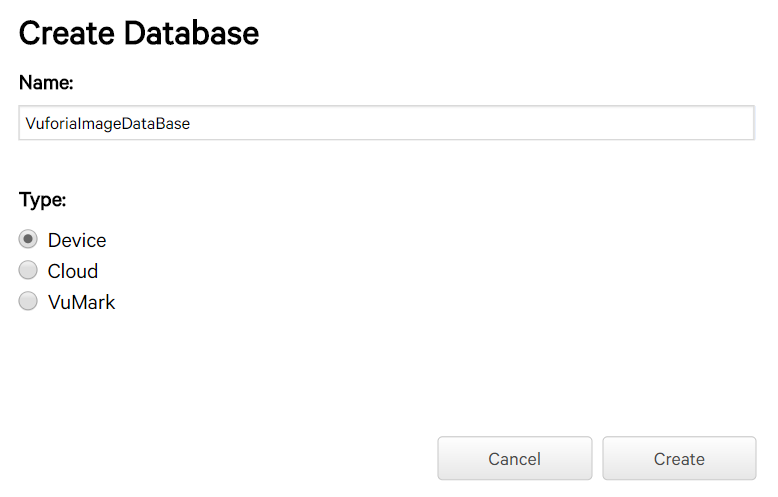

1. Click on the **Add Target** button, a popup like the next image should open. Choose the **Single Image** as the _Type_, pick up the image you want to upload (e.g. this [Octocat](./assets/octocat/Octocat.jpg)) and enter the **Width** for the image. This is not the image width, instead is a relative unity which allow to scale in relation with others image you have in the same Database. Enter **50** and click on the **Add button** to process to upload the image.

    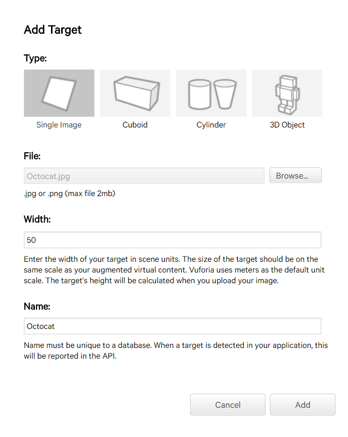

1. Now you should see a grid with the image and the most important here is the **Rating**. Higher Rating make easier to detect your image. Click on the **Download Database** button and a new popup will show. Choose **Unity Editor** and click on the **Download button** and save the given file.

    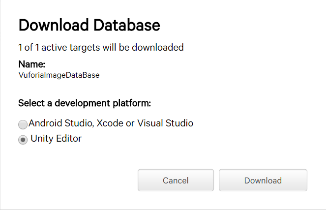

### Setup Unity Scene

1. Create a new scene. Click in the **File** menu and click in **New Scene**. **Delete** the _Main Camera_ and _Directional Ligth_. Save it with a name like _VuforiaImageRecognition.unity_.

1. Download from [here](https://developer.vuforia.com/downloads/sdk) the latest **Vuforia SDK for Unity**.

1. Go to the menu **Asserts**, **Import Package** and then **Custom Package** and locate the **Vuforia SDK** you have downloaded in the previous step. After a few moments, a dialog will show to confirm the import process. Click on the **Import** button.

1. On the _Project view_, navigate to the **Vuforia\Prefab** folder and drag the **ARCamera** component to the _Hierarchy view_. This component will be the camera which your app will constantly scan trying to identify your image. With the **ARCamera** selected, go to the _Inspector view_ and click on the **Open Vuforia configuration**. Paste your **App License Key** you have saved from prior steps.

    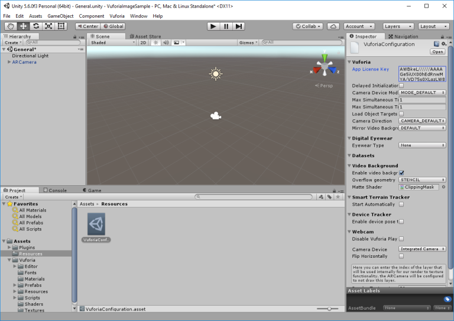

1. Locate the **Datasets** node and ensure the **Load** is checked and next check the child **Activate** option. This tells to Vuforia to load and activate the Database when the scene starts.

1. Go back to the **Vuforia\Prefab** folder in the _Project view_ and drag the **ImageTarget** component to the _Hierarchy view_. This component is the responsible for recognizing your image from what the **ARCamera** capture. Maintain selected this component and go to the _Inspector view_ and in the **Image Target Behiavor**, select your database and then your **Image Target** from the combo.

    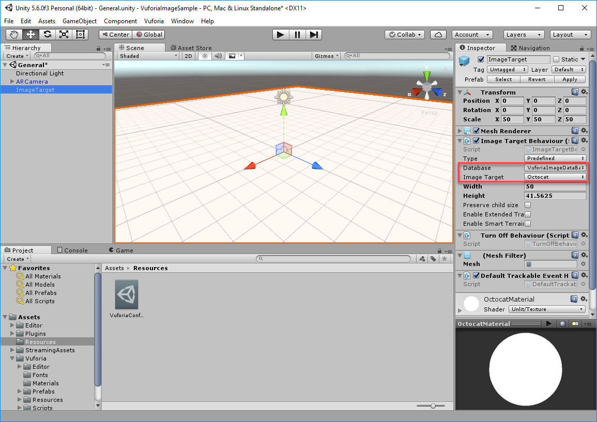

1. Go to the **Assets** menu and then click on **Import new Asset**. Pick up the `octocat.obj` file from its [assets](./assets/octocat) folder. Next, drag the object to the _Hierarchy View_, as child of your

1. In the Project tab, navigate to the Assets\Editor\QCAR\ImageTargetTexture\\ and select the image that is there. In the Inspector tab, change texture type to sprite and click apply. Now, you can see the original image you have uploaded and recognizing. With that in mind, you can set the transform properties of the Octocat 3D object as you want to base on the right image position. You may use the same position info as I:

    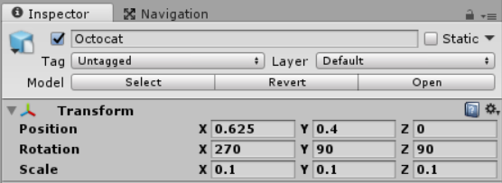

1. You can test your scene into Unity and you should get your hologram _materialized_ when the image is recognized.

    > NOTE: Unity3D Use the integrated cam or WebCam of your computer to enable you to test, so you will need one to test this way.

    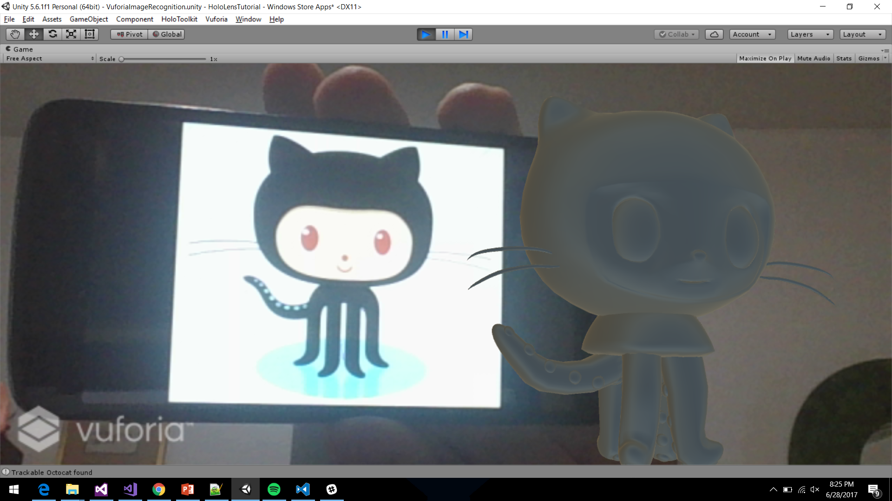

1. You can also try to deploy to your _Hololens Device_ or _Emulator_. To do that, remember to set this scene as the only available in the **Build Setting** menu and to configure the scene (**Apply HoloLens Scene Settings**) and check the WebCam Capability is checked too (Apply **HoloLens Capability Settings**).

## Task 2: Object Recognition and Track

### Scan the Object

1. To accomplish the object recognition, you need to scan the object and convert it scan into information Vuforia can track. Download the from **Vuforia Object Scanner** (_only available for Android Devices_) from [here](https://developer.vuforia.com/downloads/tool) and install onto your device.

1. Before you begin scanning objects, you’ll need to print out the [Object Scanning target](./assets/A4-ObjectScanningTarget.pdf) and understand how it is used. The object you intend to scan should be placed on the grid area of the target as shown in the picture below.

    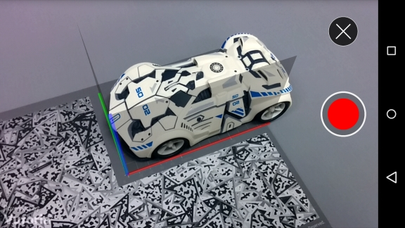

1. Press the record button to begin scanning. Move the camera around the object to capture the vantage points that will be significant to your app’s user experience. When a surface region has been successfully captured, its corresponding facet will turn green.

1. Once you’ve captured the majority of the surface areas that you want to use, press the stop button to stop the scanning process. Enter a name for the scanning session.

 1. Save your file to your device or send it to your email to get download in your PC.

    > NOTE: Do not move the object or target while recording a scan.

    > NOTE: You also can use [this](./assets/plane.od) provided scanned object to upload to your Database.

1. Go back to [Vuforia Developer Portal](https://developer.vuforia.com) and next go to the **Target Manager** section to edit your database. Click **Add Target**, select the **3D Object** option and pick the file you've download from your device with your object scanned and click **Add**. And wait a few moments until the upload and processing had finished.

    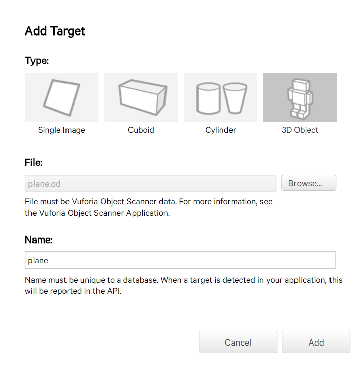

1. Click in the **Download Database (All)** button to download an _Unity Editor Database_ with the _Octocat_ image  and the Object 3d information.

### Setup Vuforia

1. In Unity3d, import (**Asserts**, **Import Package** and then **Custom Package**) the database you've just download. When the details of the import is displayed, click on **Import**.

1. Drag the **ObjectTarget** prefab from _Vuforia\Prefabs_ in the _Project View_ onto _Hierarchy View_.

You can keep the **ImageTarget** GameObject (preferred) so when Vuforia detect anyone will display children elements.

1. Select the **ObjectTarget** GameObject in the _Hierarchy View_ and select **\<YourDatabaseName\>\_OT** in the _Database_ combo and your object name in the **Object Target** (if wasn't select by default) in the _Inspector View_.

    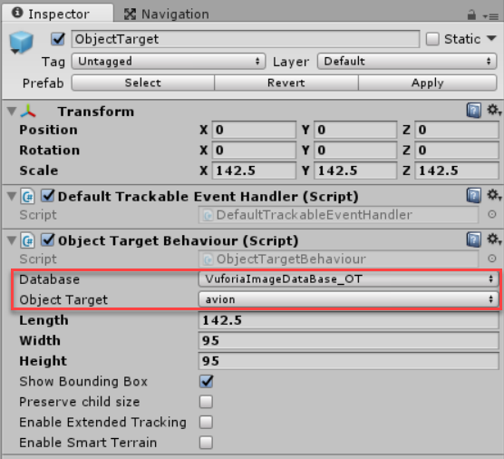

1. Put some spectacular model that will be trigger when Vuforia recognize your object. Or you can import the SU-35 3D model from the [asset](./assets/Su-35) folder (**Assets** and then **Import New Asset**) and drag it as a child of the ObjectTarget GameObject. You can try to configure the transform values with the following ones:

    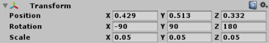

1. Go to the **Vuforia** menu and next click **Configuration**. In the dataset section, ensure all databases there is checked and activated.

    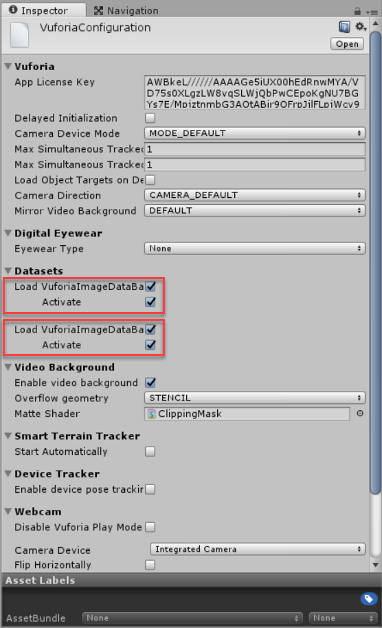

1. You can test your scene in the Unity's Game View and then deploy to your _Hololens Device_ or _Emulator_.

## Task 3: Integrate with Cognitive Services

### Setup Cognitive Services account

1. Navigate to the Microsoft Azure [Cognitive Services Portal](https://azure.microsoft.com/en-us/try/cognitive-services/). In the Vision tab, click on the **Create** button corresponding to the **Computer Vision API**. Complete the required fields. Login with your azure account or any other to create a free account. A new page should appear with the **Endpoint** and **Keys** to use the service. Save then for late use. Repeat the same process but with the FaceAPI service.

    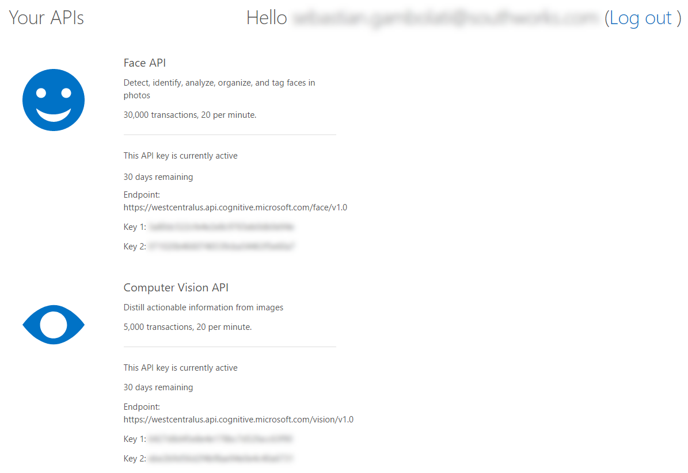

### Setup Unity Scene

1. Create a new scene. Click in the **File** menu and click in **New Scene**. Save it with a name like _CognitiveServices.unity_.

1. Create an empty GameObject and rename to `ServiceOrchestrator`. Create a new script named `CognitiveServicesClient` in the script folder. Attach it to the `ServiceOrchestrator` GameObject. Open it with Visual Studio.

1. You need to take a photo of that the user is viewing at a configurable interval and send it image to the each service and evaluate the JSON response of each one. This interval of time between each photo capture is good to be defined in the Unity Editor. To take a photo you can use this code snippets:

    ``` csharp
    using System.IO;
    using System.Linq;
    using UnityEngine;
    using UnityEngine.VR.WSA.WebCam;

    ...

    private PhotoCapture photoCapture = null;

    private const string FILE_NAME = @"cognitive_analysis.jpg";

    // This method request to create a PhotoCapture object.
    // When its finish created, call the OnPhotoCreated method.
    private void Analyze()
    {
        PhotoCapture.CreateAsync(false, this.OnPhotoCreated);
    }

    // This method store the PhotoCapture object just created and retrieve the high quality
    // available for the camera and then request to start capturing the photo with the
    // given camera parameters.
    private void OnPhotoCreated(PhotoCapture captureObject)
    {
        this.photoCapture = captureObject;

        Resolution cameraResolution = PhotoCapture.SupportedResolutions.OrderByDescending((res) => res.width * res.height).First();

        CameraParameters c = new CameraParameters()
        {
            hologramOpacity = 0.0f,
            cameraResolutionWidth = cameraResolution.width,
            cameraResolutionHeight = cameraResolution.height,
            pixelFormat = CapturePixelFormat.BGRA32
        };
        captureObject.StartPhotoModeAsync(c, this.OnPhotoModeStarted);
    }

    // This method is called when we have access to the camera and can take photo with it.
    // We request to take the photo and store it in the storage.
    private void OnPhotoModeStarted(PhotoCapture.PhotoCaptureResult result)
    {
        if (result.success)
        {
            string filename = string.Format(FILE_NAME);
            string filePath = Path.Combine(Application.persistentDataPath, filename);
            this.photoCapture.TakePhotoAsync(filePath, PhotoCaptureFileOutputFormat.JPG, this.OnCapturedPhotoToDisk);
        }
        else
        {
            Debug.LogError("Unable to start photo mode.");
        }
    }

    // This method is called when the photo is finish taked (or not, so check the succes property)
    // We can read the file from disk and do anything we need with it.
    // Finally, we request to stop the photo mode to free the resource.
    private void OnCapturedPhotoToDisk(PhotoCapture.PhotoCaptureResult result)
    {
        if (result.success)
        {
            string filename = string.Format(FILE_NAME);
            string filePath = Path.Combine(Application.persistentDataPath, filename);

            byte[] image = File.ReadAllBytes(filePath);

            // We have the photo taken.

        }
        else
        {
            Debug.LogError("Failed to save Photo to disk.");
        }
        this.photoCapture.StopPhotoModeAsync(this.OnStoppedPhotoMode);
    }

    // This method is called when the photo mode is stopped and we can dispose the resources allocated.
    private void OnStoppedPhotoMode(PhotoCapture.PhotoCaptureResult result)
    {
        this.photoCapture.Dispose();
        this.photoCapture = null;
    }
    ```

    > NOTE: Verify your app have the WebCam Capability is enabled (Apply **HoloLens Capability Settings**).


1. In the `Start` you can invoke the `Analyze` method to start the Photo Capture workflow. But it will call once. Neither you can call in the `Update`, because it is called every frame so it will be a **madness**. So, you can call a method with a given recurrence in seconds like:

    ``` csharp
    void Start()
    {
        InvokeRepeating("Analyze", 5f, 30f);
    }
    ```

    > NOTE: The second parameter is the time in seconds to wait to do the first call. The third is the time in seconds between each call.

1. Now, you can do the dirty work calling each REST service and see what return. Create a new method called `RunComputerVisionAnalysis` with the code below.

    ``` csharp
   private IEnumerator RunComputerVisionanalysis(byte[] image)
    {
        var headers = new Dictionary<string, string>() {
            { "Ocp-Apim-Subscription-Key", ComputerVisionKey },
            { "Content-Type", "application/octet-stream" }
        };

        string ComputerVisionURL = ComputerVisionUriBase + "?visualFeatures=Categories,Description&language=en";

        WWW httpClient = new WWW(ComputerVisionURL, image, headers);
        yield return httpClient;

        //When return ...
        var jsonResult = httpClient.text;

        List<string> tags = new List<string>();
        var jsonResults = httpClient.text;
        var result = JsonUtility.FromJson<ComputerVisionResult>(jsonResults);

        this.TagsTextbox.text = string.Join("\n", result.description.tags);
        this.ImageCaptionTextbox.text = string.Join("\n", result.description.captions.OrderByDescending(x => x.confidence).Select(x => x.text).ToArray());
    }
    ```

1. To not compromise the fluid UI while the call of the REST service return, we cannot directly call this method. So, we need to use a [CoRoutine](https://docs.unity3d.com/Manual/BestPracticeUnderstandingPerformanceInUnity3.html) to run this process in a separated thread.

1. Create a new file with will contains an auxiliary class to hold the service serialized response as below:

    ``` csharp
    public class ComputerVisionResult
    {
        public Categories[] categories;
        public Description description;
    }

    [Serializable]
    public class Categories
    {
        public string name;
        public double score;
    }

    [Serializable]
    public class Description
    {
        public string[] tags;
        public DescriptionCaption[] captions;
    }

    [Serializable]
    public class DescriptionCaption
    {
        public string text;
        public double confidence;
    }

    ```

### Generate the UI

1. Back to Unity Editor. Go to GameObject menu, next **UI** and then click on **Text**. This will create a Canvas and a EventSystem object. Rename the Text GameObject and rename to `ComputerVisionTags`. Repeat the operation and rename the new Text to `ComputerVisionCaptions`. Change the Color font to each text to white.

1. **Delete** the _Main Camera_ and _Directional Ligth_. Drag the `HololensCamera` and the `InputManager` prefabs from the _HoloToolKit\Input\Prefabs_ folder to the **Hierarchy view**. Optionally, add a Gaze to the scene (e.g. t     he **DefaultCursor** located in _HoloToolKit\Input\Prefabs\Cursor_ folder).

1. Go to the **HoloToolKit** menu, and then **Configure** and then click **Apply HoloLens Scene Settings** and a popup should be displayed. Apply with all the options checked.

1. Select the Canvas GameObject. Change the **Render mode** in the **Canvas** Component to **Screen Space - Camera**. Drag the HololensCamera to the **Render Camera** on the same component. This will make that the Canvas will be in fixed position on the camera. Similar to what _TagAlong_ and _Billboard_ component do.

1. Drag the `ComputerVisionTags` text to the your script **Tags Textbox** property. Do the same with the `ComputerVisionCaptions` and the **Image Caption Textbox**.

1. Select the `ComputerVisionTags` text and click on the Rectangle’s Edges (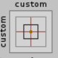) in the **Rect Transform**. While keep pressed the `Alt` key, click on the highlighted positions.

    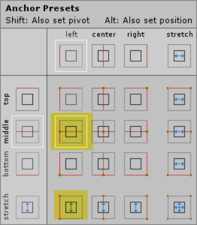

1. Select the `ComputerVisionCaptions` text and repeat the previous step selectin the following positions.

    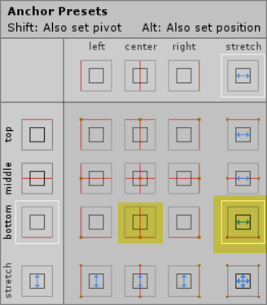

1. Test your scene in Unity's Game view. You should see similar result as:

    

### Repeat the same process to FaceAPI

1. Now, you need to do the same but with the FaceAPI REST call. Remember to define a new `Text` parameter to set the FaceAPI information on the screen. Below is the code to call and process this API info.

    ``` csharp
    public Text FaceApiCaptionTextbox;
    ...

        private void GetFaceAPITags(byte[] image)
    {
        StartCoroutine(RunFaceAPIAnalysis(image));
    }

    private const string FaceAPIUriBase = "https://westcentralus.api.cognitive.microsoft.com/face/v1.0";
    private const string FaceAPIKey = "<YourKey>";

    private IEnumerator RunFaceAPIAnalysis(byte[] image)
    {
        var headers = new Dictionary<string, string>() {
            { "Ocp-Apim-Subscription-Key", FaceAPIKey },
            { "Content-Type", "application/octet-stream" }
        };

        string FaceAPIURL = FaceAPIUriBase + "/detect?returnFaceId=true&returnFaceLandmarks=false&returnFaceAttributes=age,gender,headPose,smile,facialHair,glasses,emotion,hair,accessories";
        WWW httpClient = new WWW(FaceAPIURL, image, headers);
        yield return httpClient;

        //When return ...
        var jsonResult = httpClient.text;

        List<string> tags = new List<string>();
        // http://answers.unity3d.com/questions/1148632/jsonutility-and-arrays-error-json-must-represent-a.html
        var jsonResults = "{\"values\":" + httpClient.text + "}";

        var result = JsonUtility.FromJson<FaceAPIResult>(jsonResults);

        this.FaceApiCaptionTextbox.text = string.Join("\n",  result.values.Select(x => string.Format("Age: {0} - Gender: {1} - Glasses: {2}", x.attributes.age, x.attributes.gender, x.attributes.glasses)).ToArray());
    }
    ```

    Here is the auxiliary file with the classes used to deserialize the API response.

    ``` csharp
    namespace Assets.Scripts
    {
        using System;

        [Serializable]
        public class FaceAPIResult
        {
            public FaceData[] faceData;
        }

        [Serializable]
        public class FaceData
        {
            public string faceId;

        }

        [Serializable]
        public class FaceAttributes
        {
            public double smile;
            public string gender;
            public double age;
            public string glasses;
            public Emotions emotion;
        }

        [Serializable]
        public class Emotions
        {
            public double anger;
            public double contempt;
            public double disgust;
            public double fear;
            public double happiness;
            public double neutral;
            public double sadness;
            public double surprise;
        }
    }
    ```

1. Go back to Unity Editor and create a new Text as a child of the **Canvas** GameOject. Change the Font color to white and the position as highlighted follow:

    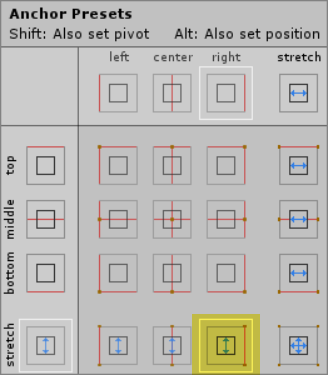

> NOTE: You can find the complete `CognitiveServicesClient` source code [here]().